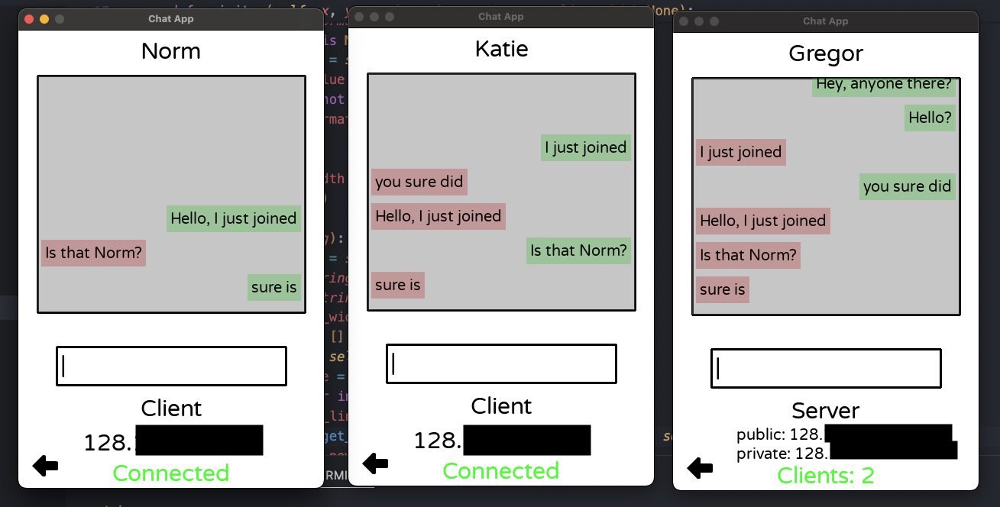
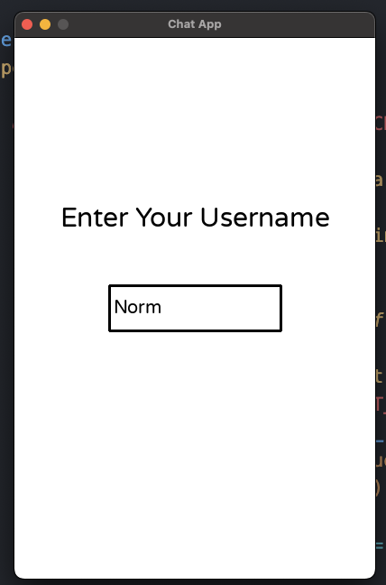
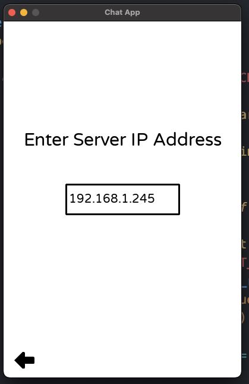

# Chat App Project



## About the Project

This is a basic messaging software I made from scratch using pygame and sockets in python. It allows users to enter a username and join or host a server. Then users can send messages to other users within that network. The functionality of the buttons, textboxes, temporary banners, and menus is entirely designed from scratch with a graphics library called pygame. The networking aspect is built with a low level python networking library called sockets.





## Networking Example

```python
while True:
    try:
        msg_type, data = self._recv(conn)
    except socket.timeout:
        continue

    if msg_type == self.MsgType.CHAT:
        print("[SERVER] recived msg")
        self.recv_queue.append({"id": conn_id, "content": data})
        if len(self.connections) > 1:
            mod_connections = self.connections.copy()
            mod_connections.remove(conn_id)
            self.send_queue.append((data, mod_connections))

    ...
```

The above is a section of code from chatconn.py in the _client_handler() method. This code is part of thread that is created when the server is connected to a client. The code first tries to recieve a message and if that message is a CHAT message (as opposed to a BREAK message) it appends the contents of the message in a queue so it can be accessed by other parts of the program (like the UI). Next, it checks if the server has other clients and if it does it gets the IDs of all the other clients and sends each of them a copy of the message. 


## Attributions

- open source UI art is by [Kenney](https://kenney.nl/)


